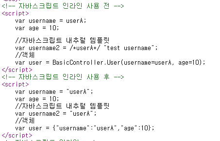
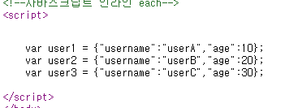

### 자바스크립트 인라인

```html
<!-- 자바스크립트 인라인 사용 전 -->
<script>
    var username = [[${user.username}]];
    var age = [[${user.age}]];

    //자바스크립트 내추럴 템플릿
    var username2 = /*[[${user.username}]]*/ "test username";
    //객체
    var user = [[${user}]];
</script>
<!-- 자바스크립트 인라인 사용 후 -->
<script th:inline="javascript">
    var username = [[${user.username}]];
    var age = [[${user.age}]];
    //자바스크립트 내추럴 템플릿
    var username2 = /*[[${user.username}]]*/ "test username";
    //객체
    var user = [[${user}]];
</script>
```



th:inline을 사용하면 문자열같은 경우에 자동으로 따옴표를 만들어주고
그리고 내추럴 템플릿을 사용할수 있다.(타임리프를 통해서 렌더링되었을때만 값이 출력)

객체에 경우에는 Json으로 변환해준다.

---

### 자바스크립트 인라인 반복문

```html
<script th:inline="javascript">

    [# th:each="user, stat : ${users}"]
    var user[[${stat.count}]] = [[${user}]];
    [/]
</script>
```
특별한 문법을 사용해서 반복문을 사용할수 있다.
