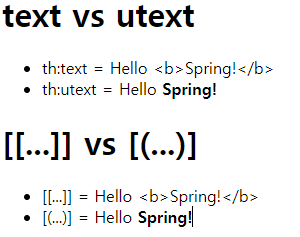

---
### th:text & th:utext

```html
model.addAttribute("data", "Hello <b>Spring!</b>");

<li>th:text = <span th:text="${data}"></span></li> => <>가 이스케이프 처리되어서 출력
<li>th:utext = <span th:utext="${data}"></span></li> => <>가 이스케이프처리가 되지않고 출력


<li><span th:inline="none">[[...]] = </span>[[${data}]]</li> => <>가 이스케이프 처리되어서 출력
<li><span th:inline="none">[(...)] = </span>[(${data})]</li> => <>가 이스케이프처리가 되지않고 출력
```


---
### th:with 타임리프 지역변수사용 
```html
<div th:with="first=${users[0]}">
    <p>처음 사람의 이름은 <span th:text="${first.username}"></span></p>
</div>
first에 값이 담긴다.
```