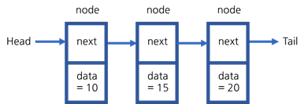
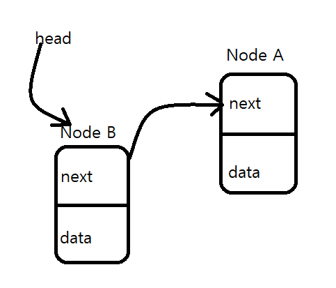
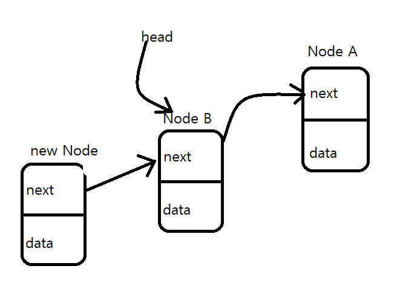
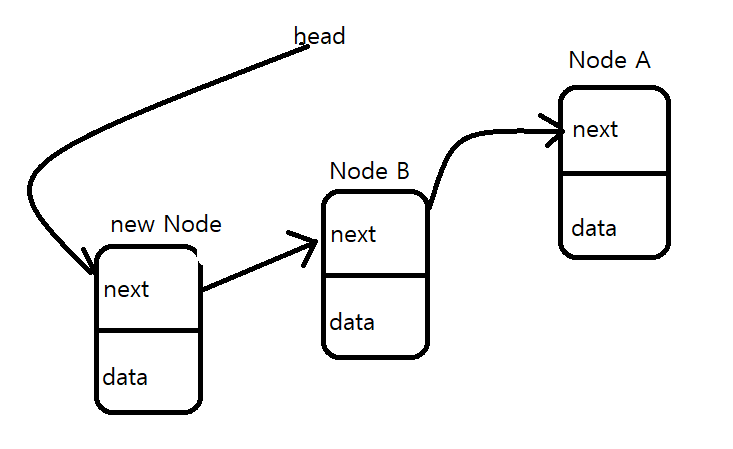

## LinkedList 연결 리스트



포인터를 사용해 여러개의 노드를 연결하는 자료구조를 LinkedList라고 한다.

기본 구성요소는 노드이며, 노드에는 두가지 정보가 들어있다.

첫번째는 다음 노드를 가르키는 next라는 포인터, 두번째는 노드에 담긴 데이터를 가리키는 포인터

리스트는 head라는 이름의 포인터에서 시작한다.

head는 리스트의 첫번째 노드를 가르키고 우리는 헤드만 알고있기 때문에

두번째 노드의 데이터를 찾으려면 head.next.data

세번쨰 노드의 데이터를 찾으려면 head.next.next.data 이런식으로 찾아야 한다.

탐색하려면 head부터 순차적으로 탐색하여야 한다.

```java
public class LinkedList<E> implements List<E> {

    //노드 정의
    class Node<E> {
        E data;
        Node<E> next;

        public Node(E obj) {
            data = obj;
            next = null;
        }
    }

    private Node<E> head; // 첫번째 노드를 가르키는 포인터

    private int currentSize; // 현재 리스트의 크기

    public LinkedList {
        head = null;
        currentSize = 0;
    }
}
```

```
Node를 내부클래스로 만들어서 LinkedList를 통해 접근하게 만들었고,

head에는 첫번째 노드
currentSize는 현재 리스트의 크기

currentSize가 없으면 리스트의 크기를 구할때 시간복잡도가 θ(n)이 된다.
우리는 head노드밖에 모르기 때문에 head.next, head.next.next이런식으로 노드의 갯수만큼 탐색해야 하는데
리스트에 노드가 추가, 삭제 될때마다 currentSize의 값을 증가 감소 시켜주면 시간복잡도는 상수 1이 된다.
```

### addFirst 메소드







```java
public void addFirst(E obj){
        Node<E> node=new Node(obj); // 새로운 노드 생성
        node.next=head; // 새로운 노드의 next포인터가 현재 head가 가르키는 node를 갖는다.
        head=node; // head를 새로운 노드를 가르키게 한다.
        currentSize++; // 리스트의 사이즈 변수를 키워준다.
        }
```

```
node.next = head
head = node
위 코드의 순서를 유의해야 한다.

순서가 바뀌게 되면 기존에 노드들은 도달할 수 없게 되어 가비지 컬렉터의 의해 제거가 된다.
```

---

### addLast 메소드

가장 첫번째 노드인 헤드부터 순서대로 탐색하는 방법

리스트 요소의 갯수만큼 탐색하기 때문에 시간복잡도는 O(n)이 된다.

```java
public void addLast(E obj){
        Node<E> node=new Node(obj);
        
        if (head == null) {
            head = node;
            currentSize++;
        }

        Node<E> tmp = head;

        while(tmp.next!=null){
        tmp=tmp.next;
        }
        
        tmp.next = node;
        currentSize++;
}
```

마지막 요소를 가리키는 tail포인터를 사용하는 방법

head부터 탐색하지 않고 마지막 요소를 가르키는 tail을 이용하기 때문에
시간복잡도는 O(1)이 된다.

```java
public void addLast(E obj) {
    Node<E> node = new Node(obj);
    
    if (head == null) {
        head = node;
        tail = node;
        currentSize++;
        return;
    }
    
    tail.next = node;
    tail = node;
    currentSize++;
}
```


### removeFirst 메소드

가장 첫번째 노드를 제거하고 그 데이터를 반환한다.
```java
public E removeFirst() {
    
    if (head == null) { // 리스트에 데이터가 없을때
        return null;
        }
    
    E tmp = head.data;
    
    if (head == tail) { // 리스트에 데이터가 1개만 있을때 (head와 tail이 가르키는 요소가 같을때)
        head = tail = null;
    } else {
        head = head.next;    
    }
    
    currentSize--;
    return tmp;
}
```


### removeLast 메소드

가장 마지막 노드를 제거하고 그 데이터를 반환한다.

```java
public E removeLast() {
    
    if (head == null){ // 리스트 내 요소가 없을때
        return null;
        }
    if (head == tail){ // 리스트 내 요소가 1개 일때
        return removeFirst();    
    }
    
    Node<E> current = head;
    Node<E> previous = null;
    
    while (current != tail) { // current: 현재 요소, previous: 현재의 바로 앞 요소
        previous = current;
        current = current.next;
    }
    
    previous.next = null; // 마지막 바로 전요소의 다음 주소로 가는 next를 null로 바꾸어 마지막 요소의 접근할수 없게 한다.
    tail = previous // tail 포인터를 바꾸어준다.
        
    currentSize--;
    
    return current.data;
}
```